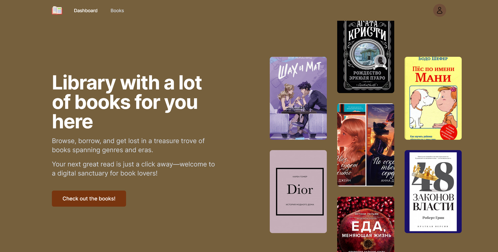

# LAR (or Library Administrative Resource)

<p style="color: rgb(128,128,128)">A way to control library's book storage and booking helper. LAR oriented on University Students and library staff</p>
<p>Backend on GO</p>


### Developers: Еларыс Арипжан, Алдыназаров Адиль

### Running:
```shell
go build && ./GolangUniversity
While the provided text discusses the general market validation for e-libraries, it's important to adapt it to your specific project: an online library reservation system
```

### Used technologies:
- General: JWT, MongoDB
- Frontend: Next.JS, TailwindCSS, RESTApi
- Backend: go, Gorm
